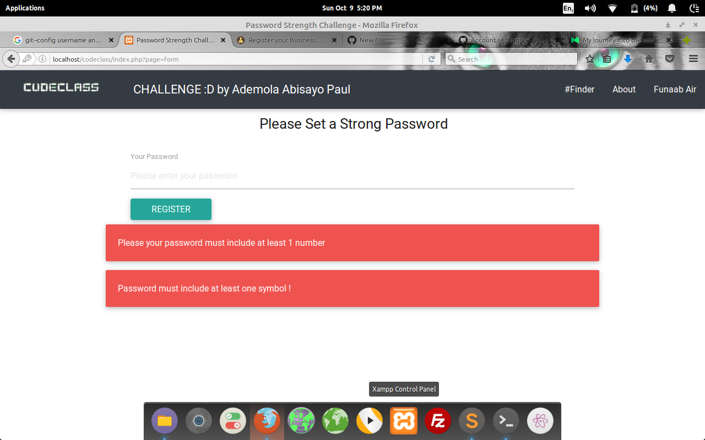
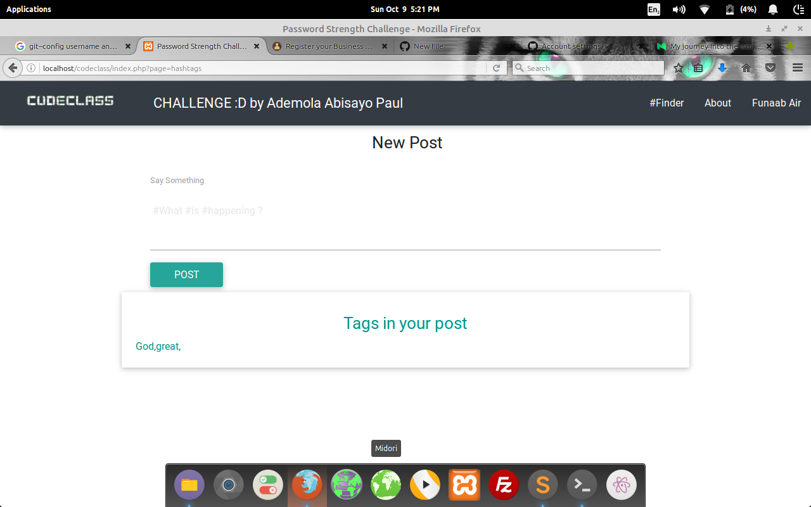

# # README # #

## Submission for password and hashtag validator app challenge ##

### What is password and hashtag validator app for ?? ###

**# * It automatically detetcts all hashtags in a post that are at the starting of a word . Also, tests strengths of password and returns appropriate error messages**

*### How do I get set up? ###*

* Because t was built with PHP, please ensure you are on a server. Just paste the folder on your server and visit the url. An example is http://yourserversurl.com/passwordapp . If you want to run it offline, there are various guides to help you on various platforms. A good installer for APACHE(offline web server) is XAMPP it works on Windows, OSX and Linux. You can search for it on google.

* Deployment instructions -If you are on a server, its all good :D .

* Repo owner - sayopaul 2016.
* Other community or team contact- http://funaabair.airviewdevs.com
